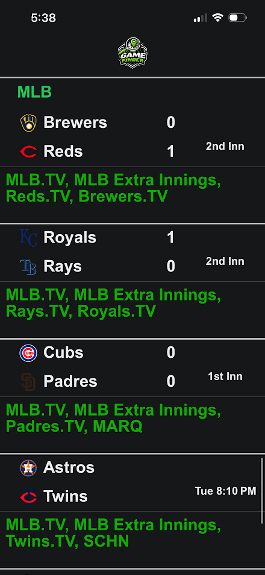
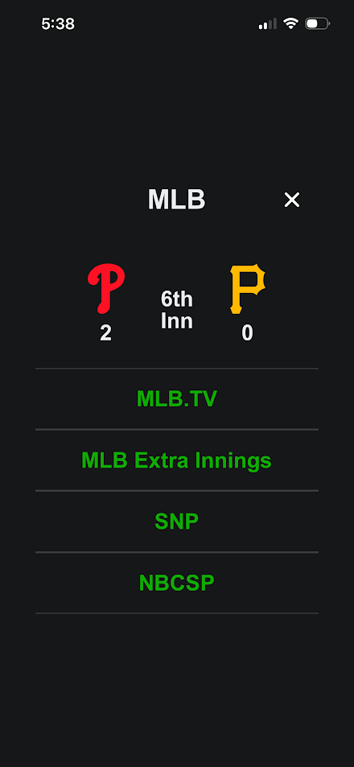

What is GameFinder?
GameFinder is a mobile app to help sports fans find what broadcast - whether national, local, or streaming service - they can watch the game on. Made with simplicity - No login or account creation and no unneccesary features. Just a simple list of all of the upcoming games and what broadcast they are on. GameFinder currently shows all games for NBA, MLB, and NFL with plans of adding NHL and college sports in later versions. This app is not currently in the app store but will be published as later versions and updates are added.

Screenshots

Features
There are three main screens this app can display - Splash Screen, Home Screen, and Game Details screen. 
The Splash screen will display while the app is getting it's data from the API and the latest games, scores, and broadcasts. Once the app has this data, the Splash screen will be removed and the home screen will be shown to the user.
The home screen will show all of the games and the broadcasts below each game in green. Updates to the score will be displayed in the app as the API data refreshes every two minutes. 

Tech stack
We used React Native with JS for both the frontend and backend. 
Expo Go is used to show users the display of the app.
Railway is used for API calls and other backend needs.

Installation
The Expo host link to view the app on your own mobile device can be found in the QR Code - Found on the LinkedIn post or in the Project files. However, you will need to download the Expo Go app before you scan the QR code.
You can view the project files in the GitHub - https://github.com/CodyFornof/Game-Finder

Folder structure
components>
parallax-scroll-view.tsx - holds the bar at the top. Game finder logo and the league container at the top
Any UI buttons or animations used throughout the app
Constants >
Styles.ts - holds all style exports
Theme.ts
Context >
AppContext.tsx - good for sending variables from fil to file/screen to screen if needed
Services and Store >
Services like api call files
Store can hold files that organize the service data
Hooks >
Ties all of the data together - useEffect that sets the order of data from receive to use

Future plans
Fix backend logic that gets the dates needed for the API - convert it to pacific time so we no longer run the risk of missing any games on our app
Make the container holding the network names dynamic based on the wrap of the text)
Add an animation that the underline of the league name moves smoothly
Add a scroll up and it refreshes
Add a feature where they can include what channels/streaming services they have - which adds a star on what games they can watch.
Make game count in the data start at game 1 for each league
Make the Frontend refresh with the API so it is auto refreshing and doesn't have to be reopened
Make the day show like "Today", "Tomorrow" games so on
Add NHL and major sport leagues

